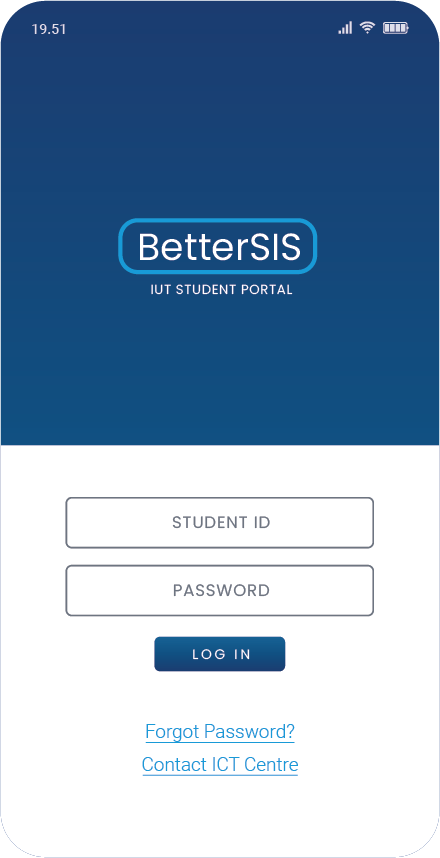
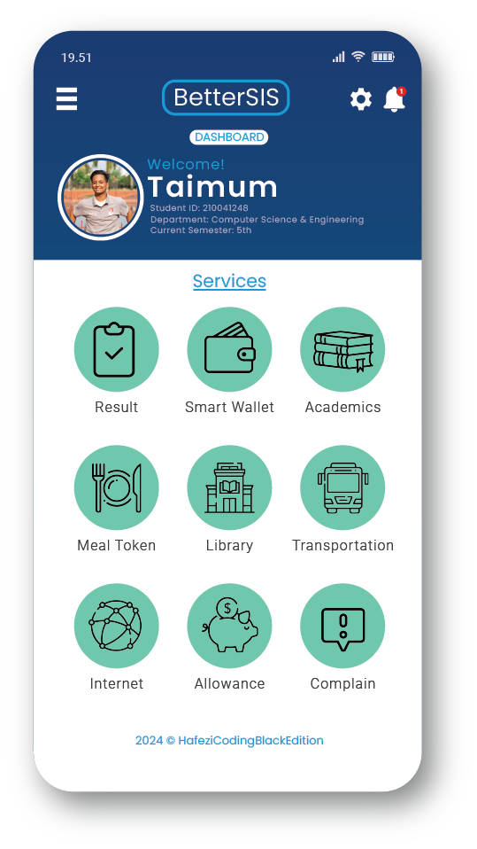
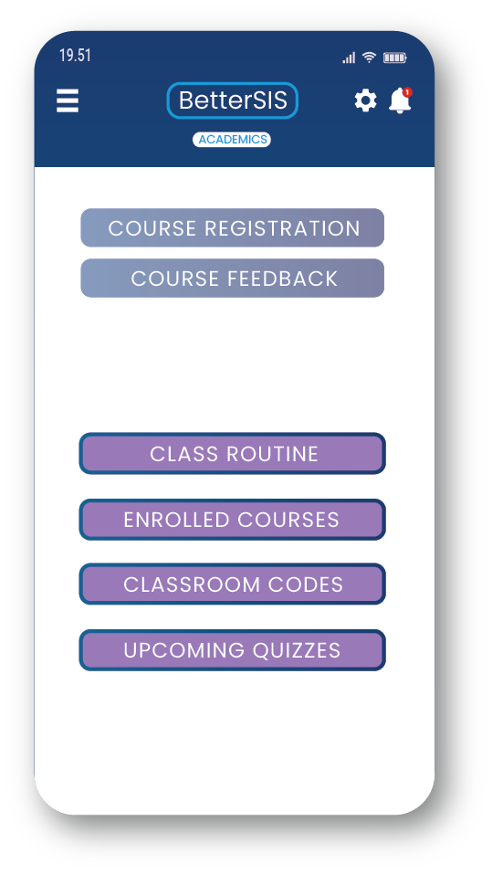
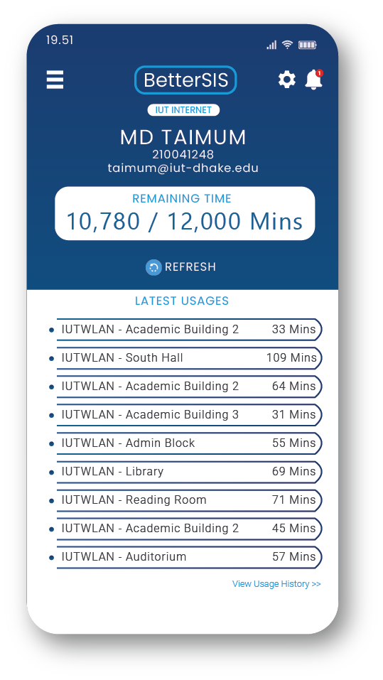
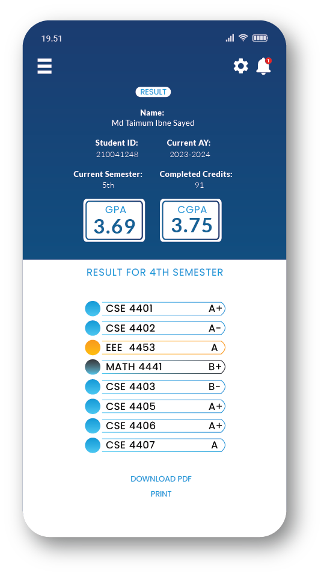
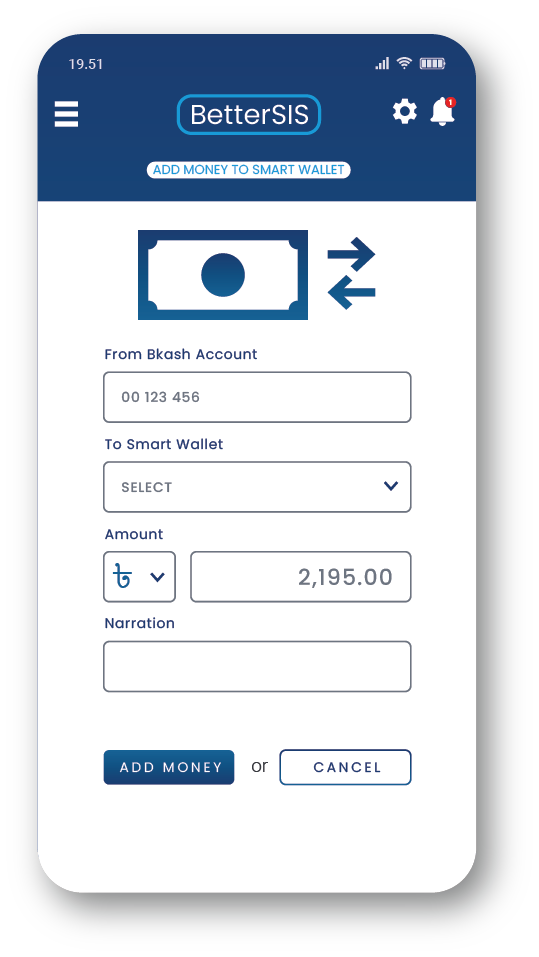
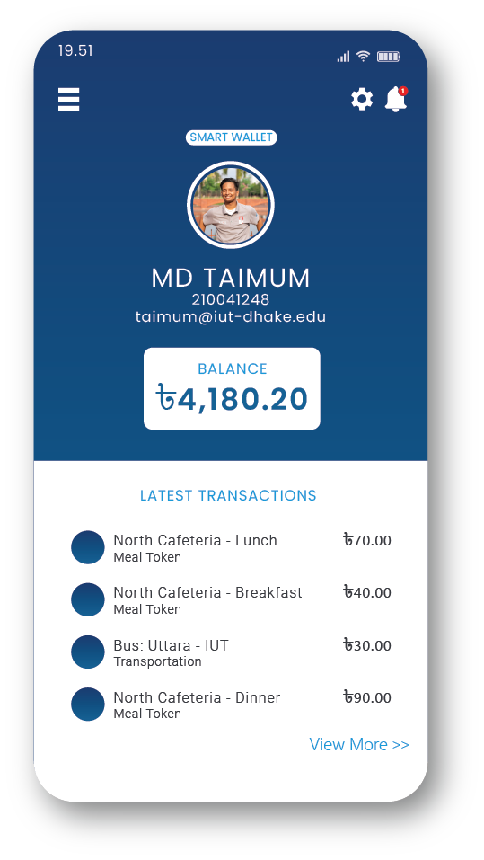
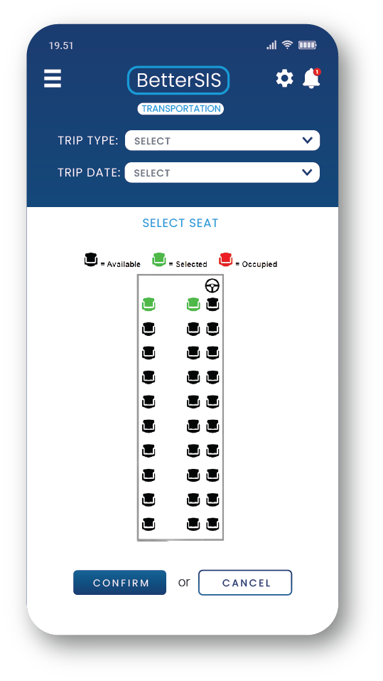

# BetterSIS
    

## Features
- **IUT Email Verification**: Access to IUT SIS 2.0 will be exclusively available to IUT students. Account creation and system login will be restricted to those using an official IUT email address.
- **Revamped Dashboard Experience**: IUT SIS 2.0 will feature a redesigned dashboard with an intuitive interface, providing a clear and organized view of all student details. 
- **Department Themed Interface**: The app will feature a customized theme for each department, reflecting their official colors. For example, CSE students will have a blue-themed interface.
- **Course Registration with Detailed Info**: A modified Course Registration Section where you can see the detailed informations about the course you are about to enrolled.
- **Enhanced Result Section**: An amazing and user friendly Result Section with some additional features.
- **Resources with Restricted Access**: Study materials, including book PDFs, lecture slides, and recordings, will be stored in a secure database. Access to these resources will be granted only to authorized students, ensuring controlled and limited availability.
- **Announcements Section**: Important announcements, including those related to administration, holidays, events, and notices, will be delivered directly to all students through the app, ensuring timely communication.
- **Internet Usage Limit Alerts**: Students will receive immediate alerts when their internet usage approaches a predetermined limit, set by themselves, to prevent any potential fines for exceeding the limit.
- **Wallet Recharge**: Smart Card can be recharged from within the app using online payment systems.
- **Cafeteria Token System**: Students can buy cafeteria tokens from the app to generate a one time QR code which will be read by the staff to provide food. 
- **IUT Bus Ticket System**: Bus tickets can be purchased through IUT SIS 2.0, which provides detailed schedules and displays the number of available tickets for the selected time.
- **Tution Fees Status**: Students will receive updates on their tuition fee status (paid or outstanding), with the amount shown in both USD and BDT, based on the current exchange rate.

## Expected Customers
- **IUT TEACHERS**
- **IUT STUDENTS**
- **IUT STAFF**

## Technology Specifications
- **STANDARD SOFTWARE**:
  1. FLUTTER for development
  2. FIREBASE for database system
  3. ANDROID STUDIO | 2024.1.2
- **NON STANDARD HARDWARES**:
  1. IUT SMART CARD
  2. QR CODE/NFC READER
- **NON STANDARD SOFTWARES**: ONLINE PAYMENT GATEWAY

## System Interaction
<table align="center">
  <tr>
    <td align="center">
       
      <em>Home Page</em>
    </td>
    <td align="center">
       
      <em>Feature Dashboard</em>
    </td>
    <td align="center">
       
      <em>Academic Updates and Schedules</em>
    </td>
  </tr>
  <tr>
    <td align="center">
       
      <em>Internet Usage Tracker</em>
    </td>
    <td align="center">
       
      <em>E-Library and Question Bank</em>
    </td>
    <td align="center">
       
      <em>Semester wise Course Results</em>
    </td>
  </tr>
  <tr>
    <td align="center">
       
      <em>E-Banking with AB-Direct</em>
    </td>
    <td align="center">
       
      <em>Smart Wallet</em>
    </td>
    <td align="center">
       
      <em>Iut Bus Service Tracker</em>
    </td>
  </tr>
  <tr>
    <td align="center">
       
      <em>Meal Token with QR Code</em>
    </td>
  </tr>
</table>

--Sprint Backlog: https://docs.google.com/spreadsheets/d/1RDhU2heGX9ymsFlywrJ08rLO7RbqRG4N989avHTFXds/edit?usp=sharing

